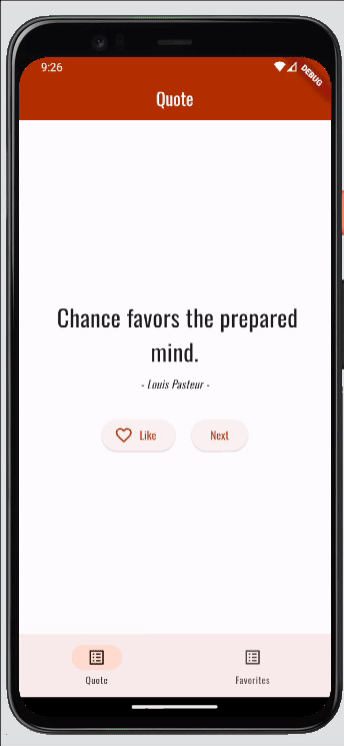
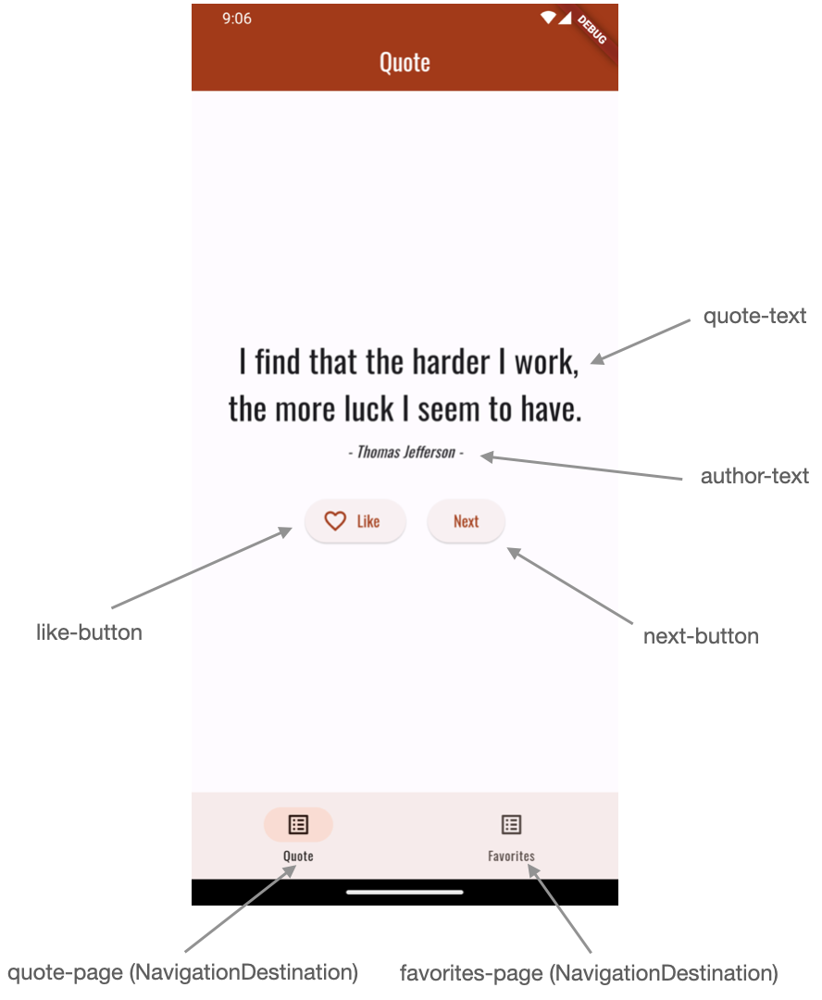

# Exercício Flutter - awesome quotes

## Objetivo

O objetivo deste exercício é desenvolver uma aplicação em flutter que mostra frases inspiradoras.

## Exercício

Este repositório foi criado já com a estrutura (em termos de ficheiros) da aplicação, só tens que criar o código necessário
dentro desses ficheiros. Já existe algum código criado para customizar o tema da aplicação.

Estão também incluídos dois ficheiros test/widget_test.dart e integration_test/integration_test.dart que 
permitem correr uma série de testes de widget/integração. Não deves alterar
estes ficheiros. Deves, no entanto, utilizá-los para validar localmente que implementaste corretamente a aplicação. 

Além disso, estes testes vão ser executados de cada vez que fazes push para o repositório[^1].

Estes testes assumem que alguns dos widgets têm uma chave específica associada, vê na imagem abaixo quais
são essas chaves:

Deves então criar a aplicação tendo em conta estes pressupostos, até que ela:
* Tenha o aspeto e comportamento apresentado na demonstração acima
* Passe os testes de widget e integração

## Dicas técnicas

Para obteres as frases "inspiradoras" irás usar a lib [awesome_quotes](https://pub.dev/packages/awesome_quotes). Esta lib
já está incluída no pubspec.yaml.

Para a navegação deves usar uma [NavigationBar](https://api.flutter.dev/flutter/material/NavigationBar-class.html). A navegação
deve ser implementada no widget `MainPage` que deves criar no ficheiro `main_page.dart`.

Deverás criar 2 singletons: `FavoritesModel` e `QuotesService`. Note-se que, por serem singletons, devem permitir criar uma
única instância da classe, acessível através da propriedade `instance`. Ex: `FavoritesModel.instance`.

A classe `FavoritesModel` deverá ser um singleton com uma propriedade `favorites` contendo uma lista de `Quote` (esta classe
está incluída na biblioteca "awesome_quotes"). Para garantir o encapsulamento, essa propriedade deve ser apenas de leitura 
(dica: usa um getter que retorne `UnmodifiableListView` ) e deves incluir um método `addFavorite(Quote quote)`.

A classe `QuotesService` deverá ser um singleton com um método `getRandomQuote()` que retorna uma quote aleatória. Esta classe
limita-se a chamar a biblioteca "awesome_quotes". No entanto, tem uma particularidade importante para facilitar os testes - 
permite "injetar" uma quote fixa através da propriedade (da classe) `testingQuote`. Quando se injeta essa quote, a classe passar a retornar
sempre esse quote no `getRandomQuote()`.

Nota que há quotes bastante grandes (com muitos carateres). Deves ter o cuidado de garantir que o texto da quote cabe sempre no ecrã
sem fazer overflow.

Se reparares, o código do testes de widget é praticamente igual aos do testes de integração. No entanto, os testes de widget
correm muito mais rápido, por isso recomendamos que executes esses testes em vez dos de integração. No entanto, pode haver
erros difíceis de diagnosticar nos testes de widget que se tornam mais óbvios nos testes de integração pois consegues ver
no emulador aquilo que está a ser testado.

[^1]: Por razões de desempenho, neste momento, os testes de integração não estão a ser executados no github.

