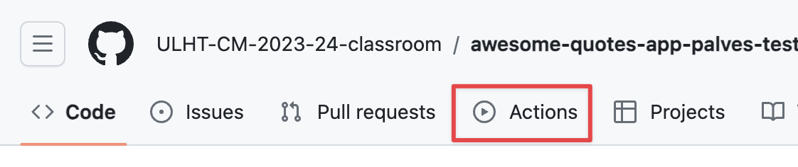

# awesome_quotes_exercise

## Preparação do repositório no github

O primeiro passo tem a ver com uma limitação do github: o repositório que foi criado para ti não tem as actions 
habilitadas por omissão. Isso quer dizer que os testes não vão correr automaticamente, 
de cada vez que fazes push (mas deviam!).

Para habilitar as actions, vai ao separador "Actions" na página inicial do repositório, deve-te aparecer uma página
"Workflows aren’t being run on this forked repository". 
Deves clicar no botão "I understand my workflows, go ahead and enable them".

## Objetivo

O objetivo deste exercício é desenvolver uma aplicação em flutter que mostra frases inspiradoras.

## Exercício

Este repositório foi criado já com a estrutura (em termos de ficheiros) da aplicação, só tens que criar o código necessário
dentro desses ficheiros. Já existe algum código criado para customizar o tema da aplicação.

Está também incluído um ficheiro integration_test.dart que permite correr uma série de testes de integração. Não deves alterar
este ficheiro. Estes testes vão ser executados de cada vez que fazes push para o repositório.

Estes testes de integração assumem que alguns dos widgets têm uma chave específica associada, vê na imagem abaixo quais
são essas chaves:

Deves então criar a aplicação tendo em conta estes pressupostos, até que ela:
* Tenha o aspeto e comportamento apresentado na demonstração acima
* Passe os testes de integração

## Dicas técnicas

Para obteres as frases "inspiradoras" irás usar a lib [awesome_quotes](https://pub.dev/packages/awesome_quotes). Esta lib
já está incluída no pubspec.yaml.

Para a navegação deves usar uma [NavigationBar](https://api.flutter.dev/flutter/material/NavigationBar-class.html)

A classe `FavoritesModel` deverá ser um singleton com uma propriedade `favorites` contendo uma lista de `Quote` (esta classe
está incluída na biblioteca "awesome_quotes".

